# Qu'est ce que le GitOPS ?

GitOPS est une méthodologie de gestion et de déploiement d'infrastructures et d'application, s'appuyant sur les principes du DevOPS mais en prenant GIT comme seule source de vérité.

Toute l'infrastructure, la configuration et le déploiement applicatifs sont décrit sous forme de code (IaC) et versionné dans un dépot GIT.

Les changements apportés à ce dépôt deviennent la référence officielle de l’état souhaité du système.
Un agent d’automatisation (comme ArgoCD ou FluxCD) se charge de synchroniser l’état réel de l’environnement (clusters, applications, configurations…) avec cet état déclaré dans Git.

## Fonctionnement

1. Déclaration de l’état désiré :
    - L’équipe définit dans un dépôt Git la description complète de l’infrastructure, des services, des configurations et des secrets nécessaires (via YAML, Helm Charts, Terraform, Kustomize, etc.).
    - Cet état est versionné et validé comme pour du code applicatif.

2. Automatisation de la synchronisation :
    - Un opérateur GitOps (par ex. Argo CD ou Flux CD) observe en continu le dépôt Git.
    - Lorsqu’un changement est détecté (commit, merge, tag…), l’opérateur applique automatiquement les modifications à l’environnement cible (souvent Kubernetes ou Ansible).

3. Observation et correction automatique :
    - Le contrôleur compare en permanence l’état actuel du cluster à l’état décrit dans Git.
    - En cas d’écart, il tente de réconcilier automatiquement ou d’alerter les équipes.

## Diagramme

```mermaid
flowchart LR
    subgraph Dev["👨‍💻 Développeur"]
        C[Commit / Merge Request]
    end

    subgraph GitRepo["📦 Dépôt Git (source de vérité)"]
        G[(Manifests YAML / Helm Charts)]
    end

    subgraph ArgoCD["⚙️ Argo CD (Agent GitOps)"]
        A1[Surveille les changements Git]
        A2[Compare état Git ↔ état du cluster]
        A3[Applique les modifications]
    end

    subgraph K8S["☸️ Kubernetes Cluster"]
        APP["🚀 Application déployée"]
    end

    C --> G
    G -->|Push / Merge| A1
    A1 --> A2 --> A3 --> K8S
    K8S -->|État réel| A2
    K8S --> APP

    classDef git fill:#fdd835,stroke:#333,stroke-width:1px;
    classDef argocd fill:#4fc3f7,stroke:#333,stroke-width:1px;
    classDef k8s fill:#81c784,stroke:#333,stroke-width:1px;
    classDef app fill:#ffb74d,stroke:#333,stroke-width:1px;

    class G git
    class A1,A2,A3 argocd
    class K8S k8s
    class APP app

```

